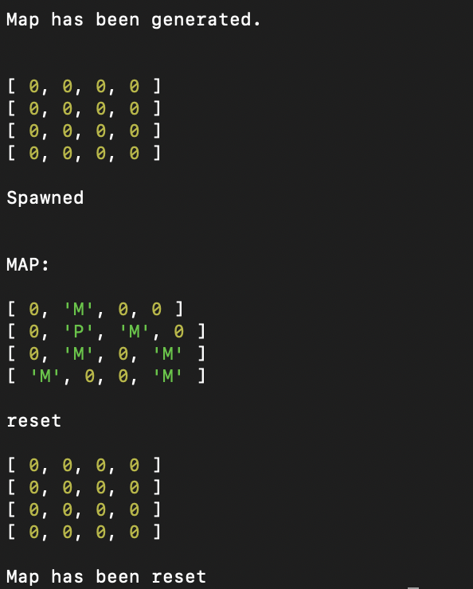
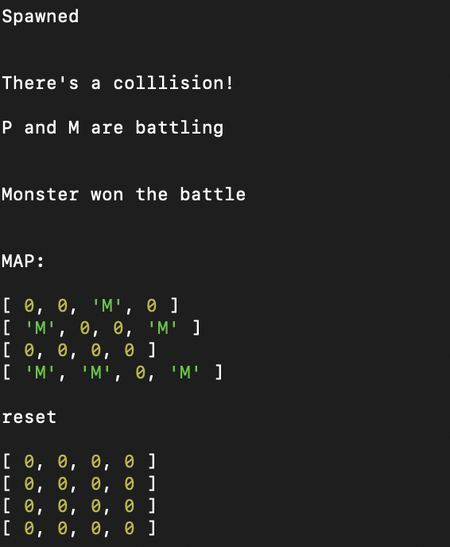

 ## RPG Map Spawn

Description:
You will create a console-based game mechanic that will have a Player class, a Monster Class, a Map Class, a spawn and collision mechanic, and finally a battle mechanic. The premise of this project is that a player and monster will generate randomly on a map. If the player collides with a monster, the battle script will run.

Player Class: Name / HP / Attacks
You have the flexibility to design your own attacks

Monster Class: Name/ HP / Attacks
You have the flexibility to design your own attacks

Map Class: 
needs a map property as an [ ] <- empty array
needs to have a method within the class to generate a 4x4 array 
[ 0, 0, 0, 0 ]
[ 0, 0, 0, 0 ]
[ 0, 0, 0, 0 ]
[ 0, 0, 0, 0 ]
a reset method to clear all elements.

Spawn / collide script:
Write a function that will randomly spawn 1 player and 6 monsters. 
[ [p],  0,  0,  [M]]
[ 0,  0, [M],  0 ]
[ 0, [M], 0, [M] ]
[ [M], 0, [M], 0 ]
Write a function that will trigger a collision status if a player and monster happen to spawn in the same location.
If a player and a monster spawn in the same location, a battle function should be invoked.

Battle: 

If a player and monster are in a battle, the monster should use a random attack on the player.
The player should also use a random attack.

EXTENSION:

Create another script that will move the player throughout the map.
Destroy all monsters to win!

SCREENSHOTS:

